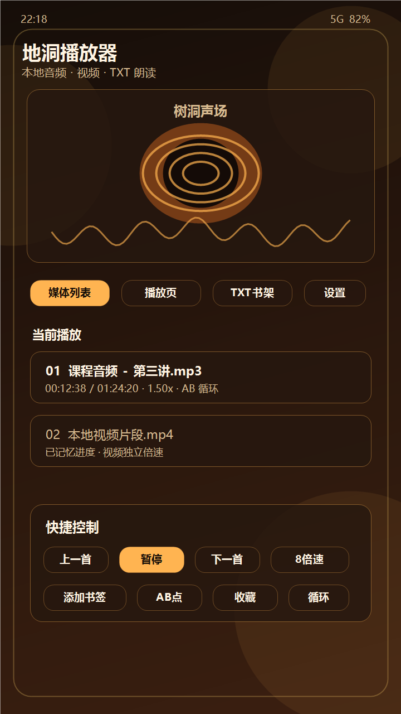
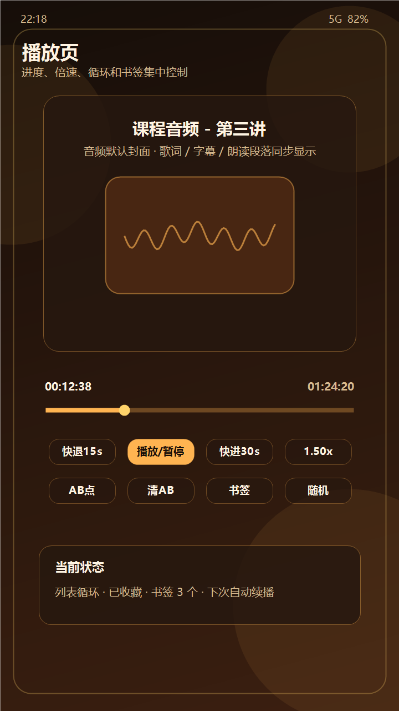
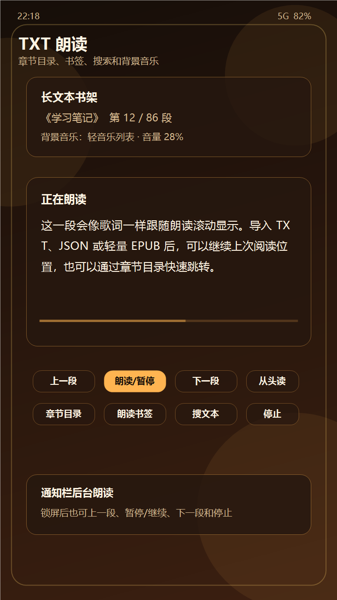

# 地洞播放器

地洞播放器是一个【安卓】优先的本地音频、视频和 TXT 朗读播放器（7MB左右）。它使用 AndroidX Media3/ExoPlayer 作为播放核心，面向听课、听书、整理本地影音和长文本朗读等场景。

当前版本：`V0.0.15`

## 界面预览

| 主界面 | 播放页 | TXT 朗读 |
| --- | --- | --- |
|  |  |  |

## 功能特性

- 扫描 SAF 文件夹，递归识别常见音频/视频格式。
- 支持直接打开单个音频/视频文件，并维护“打开的文件”列表。
- 按文件名自然排序，文件名包含数字时优先按数字排序。
- 支持音频、视频播放，视频可进入全屏和画中画。
- 支持播放位置记忆、文件夹级音频/视频独立倍速记忆。
- 支持 0.25x 到 8.0x 倍速。
- 支持顺序播放、单曲循环、列表循环、随机循环。
- 支持 AB 循环、A/B 点微调和按媒体文件记忆。
- 支持播放列表、收藏、最近播放、书签和列表清理。
- 支持系统音效增强、响度增益、低音增强、立体感增强和五段 EQ。
- 支持 LRC 歌词和 SRT 字幕导入、自动匹配和偏移调整。
- 支持 TXT/JSON/轻量 EPUB 文本导入与系统 TTS 朗读。
- 支持朗读书架、章节目录、段落书签、文本搜索和后台朗读通知。
- 支持朗读背景音乐和可选 MultiTTS 本地接口。
- 提供 Windows 免安装网页尝鲜版。

## 下载

当前调试包在本地构建后位于：

```text
release/didong-player-v0.0.15-debug.apk
```

正式公开后，建议在 GitHub Releases 中发布 APK，不建议把 APK 文件提交进 git 历史。

## 构建

环境要求：

- JDK 17 或更高版本
- Android SDK
- Gradle Wrapper 已包含在仓库中

构建 debug APK：

```powershell
.\gradlew.bat assembleDebug
```

生成的 APK 位于：

```text
app\build\outputs\apk\debug\app-debug.apk
```

## Windows 尝鲜版

Windows 上可双击 [`启动地洞Windows版.bat`](windows/启动地洞Windows版.bat)，或直接用 Edge/Chrome 打开 [`DidongPlayer.html`](windows/DidongPlayer.html)。

这是基于浏览器本地能力实现的免安装原型。浏览器出于安全限制不会永久保存文件授权，下次打开通常需要重新扫描文件夹。

## MultiTTS 接口

设置中心可开启“使用MultiTTS接口”，会把 TXT 朗读分段发送到：

```text
http://127.0.0.1:8774/forward
```

如果 MultiTTS 未启动、接口失败或返回不可播放音频，应用会自动退回系统 TTS 朗读。

## 开源协议

本项目使用 [Apache License 2.0](LICENSE) 开源。你可以在许可证允许的范围内使用、修改和分发代码；分发时请保留版权声明和许可证文本。

## 贡献

欢迎通过 Issue 反馈问题或提出想法，有问题也可与我取得联系(公众号：小二菜园，邮箱254850837@qq.com)。提交代码前请先阅读 [CONTRIBUTING.md](CONTRIBUTING.md)。

## 后续路线

1. 继续拆分播放控制、TTS、列表管理和数据层。
2. 将 SharedPreferences/JSON 逐步迁移到 Room。
3. 改进 Windows 桌面版本，评估 Kotlin Multiplatform、Compose Desktop 或 Flutter。
4. 评估投屏能力，按设备能力接入 MediaRouter、Google Cast、DLNA 或 Miracast。
